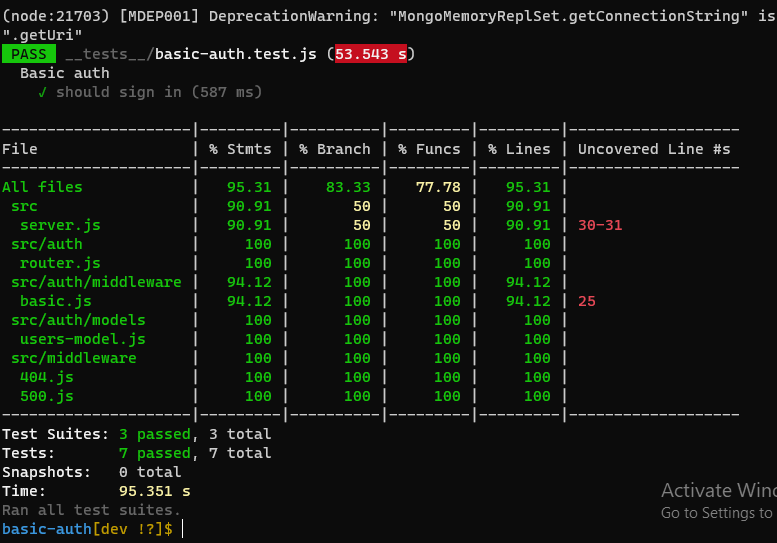

401 lab 06 Authentication

# LAB - 06
## basic-auth
### Author: Tamara Al-billeh

* [deployment for main branch]() .
* [submission PR](https://github.com/tamaraalbilleh/basic-auth/pulls) .
* [tests report](https://github.com/tamaraalbilleh/basic-auth/actions) .
 
### Setup

#### `.env` requirements

- `PORT` - 5000

#### Running the app

- `npm start`
- Endpoint: `/`
  - Returns message

    ```

    'welcome to home page!';

    ```
  
- Endpoint: `/signup`
  - Gets the user password and username stored

  ```

  {
    "_id": "60ab06e29ba645428e702d07",
    "username": "tamara",
    "password": "$2b$10$doTgTcPH1MzJFLCIN.RFLuaOdjSozHQfiFqANPChpnK9TRI5AqU92",
    "__v": 0
}

  ```

- Endpoint: `/signin`
  - Gets the user password and username from database and compare them to the ones provided 

  ```

  {
    "_id": "60ab06e29ba645428e702d07",
    "username": "tamara",
    "password": "$2b$10$doTgTcPH1MzJFLCIN.RFLuaOdjSozHQfiFqANPChpnK9TRI5AqU92",
    "__v": 0
}

  ```

- Endpoint: `/bad`
  - Throws an error 500
  - Returns an Object

    ```

    {
        "status": 500,
        "message": "something went wrong ",
        "rout": "/bad",
    }

    ```
- Endpoint: **anything else ..**
  - Returns an error 404
  - Returns an Object

    ```

    {
        "status": 404,
        "message": "Sorry , Page not Found"
    }

```
#### Tests

- Unit Tests: `npm run test`

- Lint Tests: `npm run lint`

#### UML

(Created with [diagrams](https://app.diagrams.net/))


[for more clear view](https://app.diagrams.net/#G1GaA5aQMK0g9uX-na0KZQbn8P1DantY8I) 